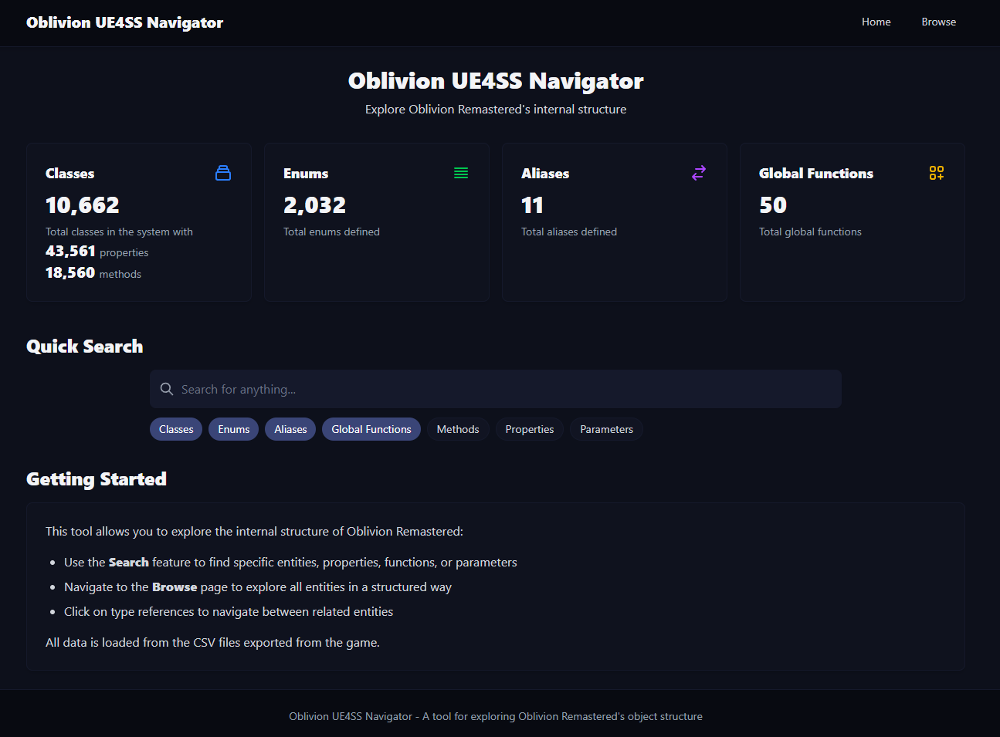

# Oblivion UE4SS Navigator

A modern web interface for exploring and searching through Oblivion Remastered's internal structure using UE4SS type data.



## Features

- 🔍 **Smart Search**: Search across multiple entity types with real-time filtering
- 🎯 **Type Filtering**: Filter results by:
  - Classes
  - Enums
  - Aliases
  - Global Functions
  - Methods
  - Properties
  - Parameters
- 🎨 **Modern Dark Theme**: Beautiful dark theme optimized for readability
- ⚡ **Fast Performance**: Built with Svelte for optimal performance
- 📱 **Responsive Design**: Works seamlessly on desktop and mobile devices

## Getting Started

### Prerequisites

- Node.js (v14 or higher)
- npm or pnpm

### Installation

1. Clone the repository:
```bash
git clone https://github.com/yourusername/OblivionUE4SSNavigator.git
cd OblivionUE4SSNavigator
```

2. Install dependencies:
```bash
npm install
# or
pnpm install
```

3. Place your UE4SS type data files in the `static/data` directory:
- `Types.lua`
- `oblivion_types.lua`

4. Start the development server:
```bash
npm run dev
# or
pnpm dev
```

The application will be available at `http://localhost:5173`

### Building for Production

To create a production build:

```bash
npm run build
# or
pnpm build
```

## Usage

1. **Quick Search**: Use the search bar at the top to find any entity by name
2. **Filter Results**: Toggle the type filters to narrow down your search
3. **Browse Results**: Results are organized by type in separate tabs
4. **Navigate**: Click on type references to navigate between related entities

## Technical Details

- Built with [Svelte](https://svelte.dev/)
- Uses TypeScript for type safety
- Implements a custom type parser for UE4SS Lua type definitions
- Features a reactive data store for efficient state management

## Contributing

Contributions are welcome! Please feel free to submit a Pull Request.

## Acknowledgments

- Built for the Oblivion Remastered modding community
- Powered by UE4SS type information
- Inspired by modern documentation browsers and type explorers
